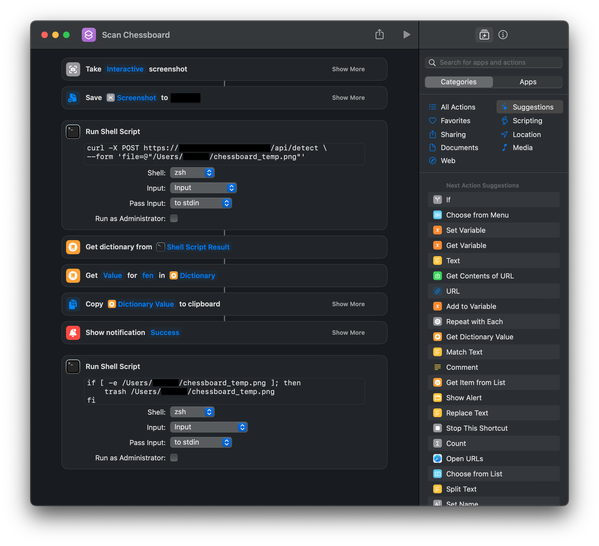

# Chess Scanner

Chess Scanner is a highly accurate machine learning model for detecting chessboard positions from cropped screenshots of chessboards. The model has been trained on various piece and board sets from popular chess websites ([Lichess](https://lichess.org) and others). The model works best with digital screenshots, although scanned images may work too (with varying results). Board annotations (arrows, circles, etc.) may cause misdetections, but generally, the model is robust to them.

The model achieves a very high accuracy with Lichess and Chess.com boards. A test set of 1000 positions was generated using `python-chess`. The model detected 1000/1000 positions correctly.

## Demo video

https://user-images.githubusercontent.com/36775736/231559078-f2c8c2d6-ce48-4a3f-be36-773f336dc6d6.mp4


## Installation

The model can be run from the command line, or deployed as an API using Docker.

### Prerequisites

1. Clone this repository.
2. Download the latest `chess_model.h5` from the [Releases](https://github.com/einoko/chess-scanner/releases) page.
3. Place the model file in the `chess-scanner` directory.

### Command Line

1. Install the required Python packages:

    ```shell
    $ pip install -r requirements.txt
    ```

2. Run the model: 
  
    ```shell
    $ python chess_eye.py <path to image> <white|black>
    ```
   The `white` or `black` argument marks the perspective of the screenshot, i.e. if ranks are numbered from 1 to 8 (`white`) or 8 to 1 (`black`).
3. After the detection is done, the model will output the detected chessboard position in [Forsyth-Edwards Notation (FEN)](https://en.wikipedia.org/wiki/Forsyth%E2%80%93Edwards_Notation).
    ```shell
    rnbqkbnr/pppppppp/8/8/8/8/PPPPPPPP/RNBQKBNR
    ```

### API

1. Make sure you have Docker installed.
2. Build the Docker image: 
  
    ```shell
    $ docker build -t chess-scanner .
    ```

3. Run the Docker container: 
  
    ```shell
    $ docker run -p 8080:8080 chess-scanner
    ```

4. The API should now be running on `http://localhost:8080`. The API has a single endpoint: `/api/predict/<white|black>`. The `white` or `black` argument marks the perspective of the screenshot, i.e. if ranks are numbered from 1 to 8 (`white`) or 8 to 1 (`black`). 
5.  You can test it with cURL as follows:
  
    ```shell
    $ curl -X POST http://localhost:8080/api/detect/white --form 'file=@"circles.png"'                        
    ```

    As a response, you should receive a JSON with the FEN string:

    ```json
    {"fen":"rnbqkbnr/pppppppp/8/8/8/8/PPPPPPPP/RNBQKBNR"}
    ```

## Shortcut

You can create a macOS Shortcut (used in the demo video) that you can invoke with a keyboard shortcut for quick access. Below is an example.


